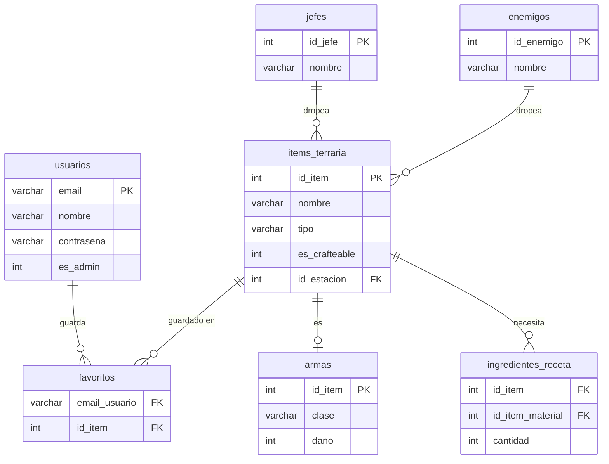

# Wiki Terraria

Aplicación de escritorio hecha en Java que funciona como una wiki del juego Terraria. Puedes consultar ítems, ver cómo se craftean o quién los dropea, guardar favoritos e iniciar sesión con tu cuenta.

---

## ¿De qué va el proyecto?

Es una wiki interactiva donde puedes buscar objetos de Terraria organizados por categorías (Armas, Materiales, Mesas, Objetos). Cada ítem tiene su ficha con descripción y método de obtención.

Cosas que puedes hacer:
- Iniciar sesión o registrarte
- Ver ítems por categoría y buscar por nombre
- Ver la receta de crafteo de un ítem o quién lo dropea
- Guardar ítems en favoritos
- Si eres admin, añadir ítems nuevos

Tecnologías usadas: Java 17, JavaFX (WebView), HTML/CSS y MySQL.

---

## Estructura del código

```
src/main/java/
├── app/
│   ├── MainApp.java        → Abre la ventana JavaFX
│   └── Controlador.java    → Conecta el HTML con Java
├── model/
│   ├── Item.java           → Clase base de los ítems
│   ├── Arma.java           → Extiende Item
│   ├── Ingrediente.java    → Material + cantidad
│   ├── Jefe.java           → Implementa FuenteDrop
│   ├── Enemigo.java        → Implementa FuenteDrop
│   ├── FuenteDrop.java     → Interfaz para Jefe y Enemigo
│   └── Usuario.java        → Datos del usuario
├── mysql/
│   ├── ItemDAO.java
│   ├── ArmaDAO.java
│   ├── UsuarioDAO.java
│   ├── JefeDAO.java
│   ├── EnemigoDAO.java
│   ├── IngredientesDAO.java
│   └── FavoritosDAO.java
└── util/
    └── DatabaseConnection.java  → Conexión a MySQL (Singleton)

src/main/resources/html/
├── login.html
├── menu.html
├── lista.html
├── ficha.html
└── favoritos.html
```

---

## Clases del modelo

**`FuenteDrop`** — Interfaz implementada por `Jefe` y `Enemigo`. Define los métodos `getId()`, `getNombre()` y `getRutaImagen()` para que ambas clases puedan tratarse igual cuando se muestra quién dropea un ítem.

**`Item`** — Clase base de todos los objetos del juego. Tiene los atributos comunes: `idItem`, `nombre`, `descripcion`, `tipo`, `esCrafteable` y `rutaImagen`. Si es crafteable, también guarda la estación necesaria y una lista de `Ingrediente`. Si no es crafteable, guarda una lista de `FuenteDrop` con quién lo dropea.

**`Arma`** — Extiende `Item`. Añade `clase` (Melee, Ranged, Invocador) y `dano`.

**`Ingrediente`** — Clase simple que guarda un `Item` (el material) y una `cantidad`. Se usa para representar cada ingrediente de una receta.

**`Jefe`** y **`Enemigo`** — Implementan `FuenteDrop`. Representan las entidades que dropean ítems al ser derrotadas.

**`Usuario`** — Guarda `email`, `nombre`, `contrasena` y `esAdmin`. También tiene una lista de `Item` con sus favoritos guardados.

---

## Diagrama Entidad-Relación



---

## Manual de uso

**Login**
Abre la app, escribe tu email y contraseña y pulsa Entrar.


**Menú principal**
Elige una categoría para ver los ítems de ese tipo.


**Ficha de ítem**
Pulsa un ítem para ver su descripción. Si se craftea verás los ingredientes y la mesa necesaria. Si se dropea verás quién lo suelta.


**Favoritos**
Pulsa "Guardar objeto" en cualquier ficha para guardarlo. Accede a tu lista desde el menú.

