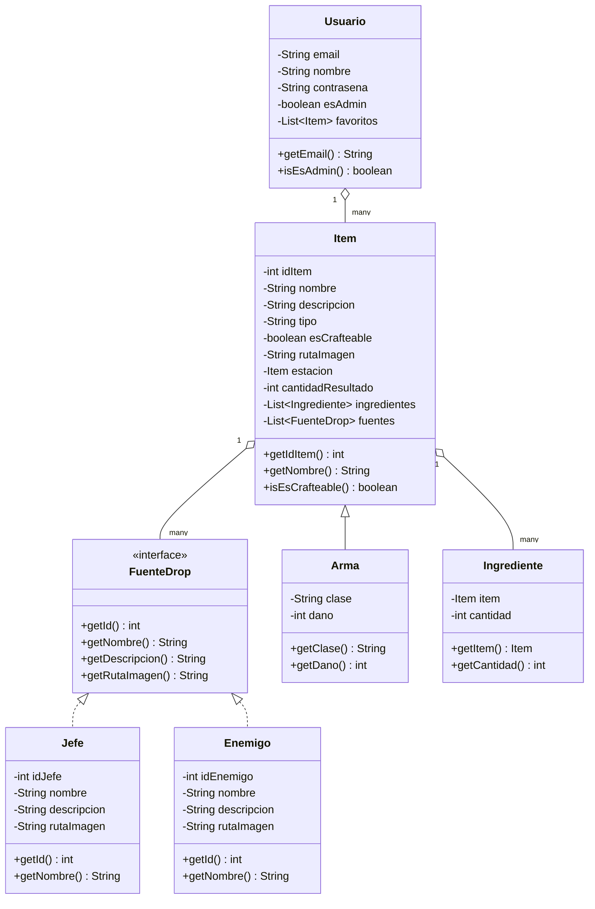

# Wiki Terraria — Proyecto YCB

Aplicación de escritorio desarrollada en **Java + JavaFX + MySQL** que funciona como una wiki interactiva del videojuego Terraria. Permite consultar información sobre ítems, armas, recetas de crafteo y drops de enemigos, con sistema de login, favoritos y panel de administrador.

---

##  Descripción del proyecto

La aplicación permite a los jugadores consultar una base de datos de objetos del juego Terraria organizada por categorías (Armas, Materiales, Mesas, Objetos). Cada ítem muestra su descripción, método de obtención y, si es crafteable, los ingredientes necesarios y la estación de trabajo requerida.

**Funcionalidades principales:**
- Inicio de sesión y registro de usuarios
- Navegación por categorías de ítems con buscador
- Ficha detallada de cada ítem (escena de crafteo o escena de drop)
- Guardar ítems en favoritos por usuario
- Panel de administrador para añadir nuevos ítems

**Stack tecnológico:**
- **Interfaz:** HTML5 + CSS3 (cargada dentro de un WebView de JavaFX)
- **Lógica:** Java 17 con Programación Orientada a Objetos
- **Base de datos:** MySQL con conector MariaDB JDBC
- **Entorno:** Visual Studio Code

---

##  Estructura del código

```
MiProyecto/
├── src/main/java/
│   ├── app/
│   │   ├── MainApp.java          # Punto de entrada, lanza la ventana JavaFX
│   │   └── Controlador.java      # Puente entre HTML/JavaScript y Java
│   ├── model/
│   │   ├── Item.java             # Clase base de todos los ítems
│   │   ├── Arma.java             # Extiende Item, añade clase y daño
│   │   ├── Ingrediente.java      # Par (Item, cantidad) para recetas
│   │   ├── Jefe.java             # Implementa FuenteDrop
│   │   ├── Enemigo.java          # Implementa FuenteDrop
│   │   ├── FuenteDrop.java       # Interfaz común para Jefe y Enemigo
│   │   └── Usuario.java          # Datos del usuario con lista de favoritos
│   ├── mysql/
│   │   ├── ItemDAO.java          # CRUD de ítems
│   │   ├── ArmaDAO.java          # CRUD de armas
│   │   ├── UsuarioDAO.java       # Login, registro y verificación
│   │   ├── JefeDAO.java          # Consulta drops por jefe
│   │   ├── EnemigoDAO.java       # Consulta drops por enemigo
│   │   ├── IngredientesDAO.java  # Ingredientes de recetas
│   │   └── FavoritosDAO.java     # Guardar y listar favoritos
│   └── util/
│       └── DatabaseConnection.java  # Singleton de conexión JDBC
└── src/main/resources/
    └── html/
        ├── login.html            # Pantalla de inicio de sesión
        ├── menu.html             # Menú principal con categorías
        ├── lista.html            # Lista de ítems por categoría
        ├── ficha.html            # Ficha detallada de un ítem
        └── favoritos.html        # Lista de favoritos del usuario
```

---

##  Diagrama de clases



---

##  Diagrama Entidad-Relación

```mermaid
erDiagram
    usuarios {
        varchar email PK
        varchar nombre
        varchar contrasena
        boolean es_admin
    }

    items_terraria {
        int id_item PK
        varchar nombre
        text descripcion
        enum tipo
        boolean es_crafteable
        varchar ruta_imagen
        int id_estacion FK
        int cantidad_resultado
    }

    armas {
        int id_item PK_FK
        varchar clase
        int dano
    }

    ingredientes_receta {
        int id_item FK
        int id_item_material FK
        int cantidad
    }

    jefes {
        int id_jefe PK
        varchar nombre
        text descripcion
        varchar ruta_imagen
    }

    enemigos {
        int id_enemigo PK
        varchar nombre
        text descripcion
        varchar ruta_imagen
    }

    botines_jefes {
        int id_jefe FK
        int id_item FK
    }

    botines_enemigos {
        int id_enemigo FK
        int id_item FK
    }

    favoritos {
        varchar email_usuario FK
        int id_item FK
    }

---

##  Manual de usuario

### Inicio de sesión

Al abrir la aplicación se muestra la pantalla de login. Introduce tu email y contraseña registrados y pulsa **Entrar**.


### Menú principal

Tras iniciar sesión aparece el menú con las categorías disponibles: **Armas**, **Materiales**, **Mesas** y **Objetos**. También hay acceso a **Favoritos** y, si eres administrador, al panel de **Añadir ítem**.


### Lista de ítems

Al pulsar una categoría se muestra la lista de ítems con su imagen y nombre. El buscador superior filtra por nombre en tiempo real.


### Ficha de ítem — Crafteo

Si el ítem es crafteable se muestra la lista de ingredientes con su cantidad y la estación de trabajo necesaria.


### Ficha de ítem — Drop

Si el ítem no es crafteable se muestra quién lo dropea (jefe o enemigo) con su imagen.


### Favoritos

Desde cualquier ficha de ítem puedes pulsar **Guardar objeto** para añadirlo a tu lista de favoritos. Accede a ella desde el botón **Recetas guardadas** del menú.


### Panel de administrador

Si tu cuenta tiene permisos de administrador aparece la opción **Añadir ítem** en el menú. Desde ahí puedes insertar nuevos ítems rellenando el formulario.


## Requisitos para ejecutar

1. **JDK 17** instalado
2. **MySQL** corriendo en `localhost:3306`
3. Base de datos `wiki_terraria` creada con el script SQL del repositorio
4. **JavaFX SDK 17** configurado en `launch.json` con `--module-path` y `--add-modules`
5. **MariaDB Connector/J** añadido a las `referencedLibraries` de VS Code

---

##  Autor

Proyecto desarrollado como reto individual del módulo de Programación por Yasin Cheurfaoui
